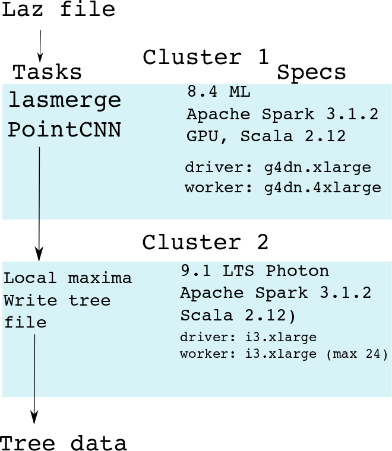
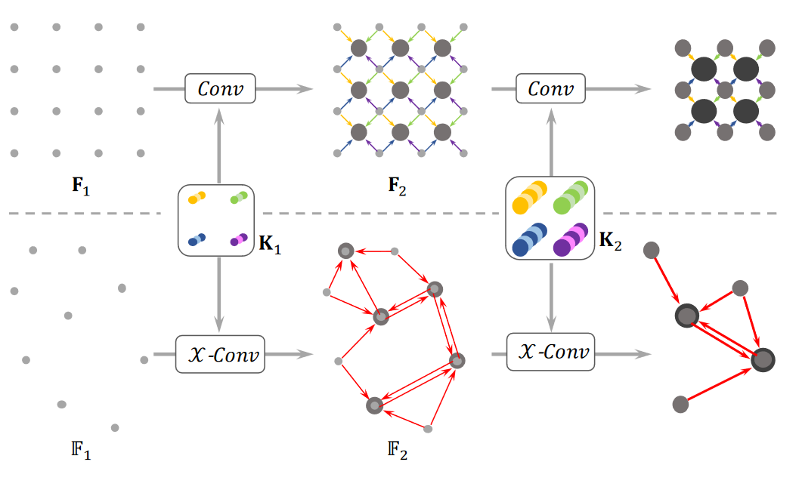

# 2021 Large Scale Data Engineering (LSDE)
## Mehmet Ege Arkin, Ramon Bussing, Mario van Rooij

- [Report](Report.pdf)
- [Project Relevance](#project-relevance)
- [Installation](#installation)
- [Visualisation](https://ram0nb.github.io/2021_LSDE/)

### Project Relevance
Since climate change is currently one of the larger global challenges that humanity is facing, tools to monitor variables
that contribute to climate change are therefore of uttermost importance. Since trees play a role in climate change, the
goal of this project is to count the number of trees in the Netherlands based on the Actueel Hoogtebestand Nederland
(AHN3) lidar point-cloud data set.

### Visualisation
[link to website](https://ram0nb.github.io/2021_LSDE/)

### Installation
Please don't. Generally causes a lot of package errors. If you do want to, please follow instructions below:

On 2 separate machines/environments run:

```
conda install --revision 0 
&& conda install -c esri arcgis_learn=1.8.5
```

and 

```
pip install laspy[lazrs,laszip]
```

### Pipeline



We used PointCNN for classification, which is a generalization of a neural network, which can work on non-regularly spaced grids.



<!-- ---------------
- Cluster 1
    - 8.4 ML
    - Apache Spark 3.1.2
    - GPU, Scala 2.12
    - Driver: g4dn.xlarge
    - Worker: g4dn.4xlarge
#### Laz file
#### &#8595;
#### lasmerge
#### &#8595;
#### PointCNN


--------------

- Cluster 2
    - 9.1 LTS Photon
    - Apache Spark 3.1.2
    - Scala 2.12
    - Driver: i3.xlarge
    - Worker: i3.xlarge (max24)


-------------- -->


